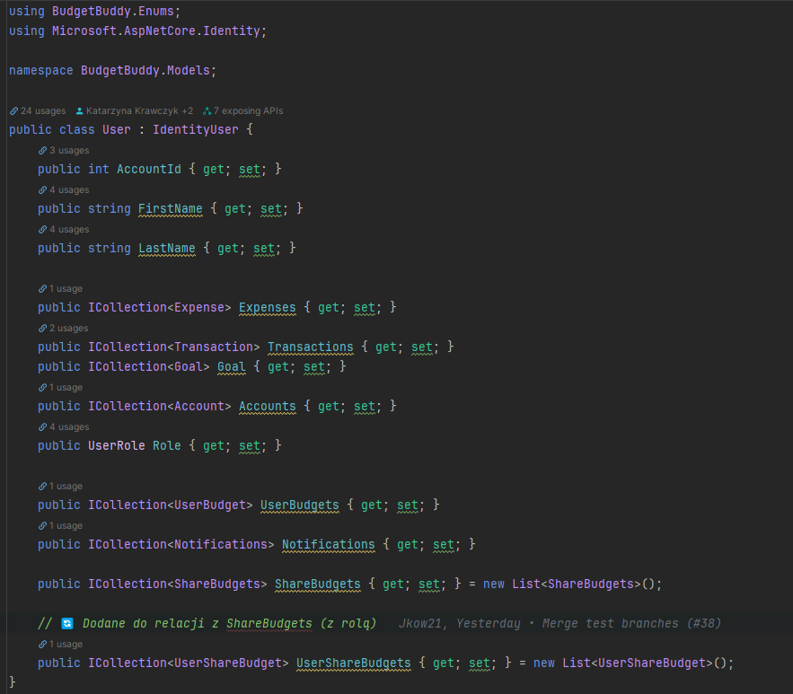
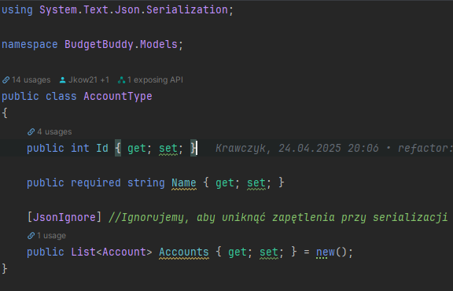
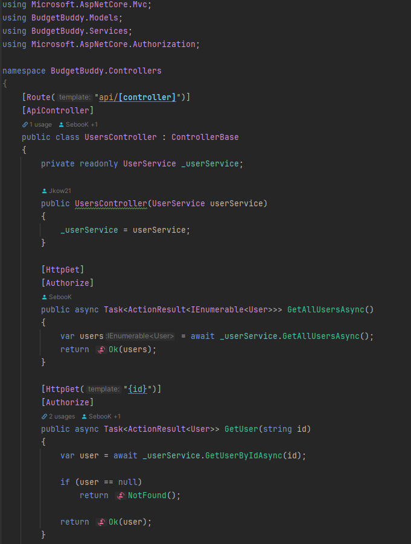
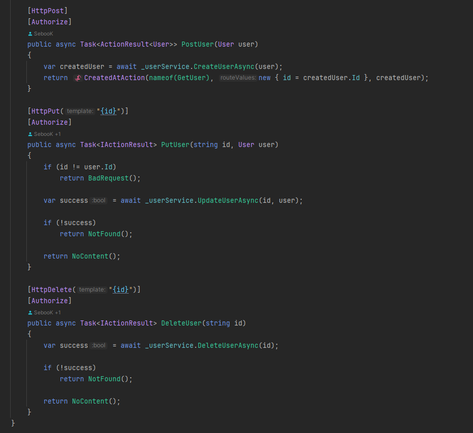
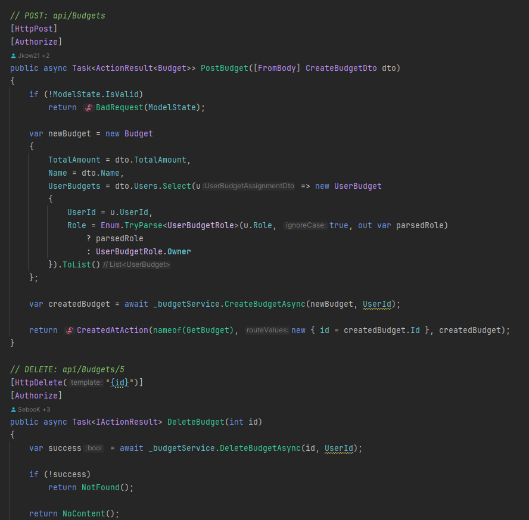
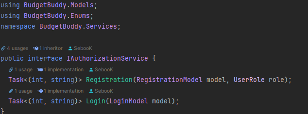
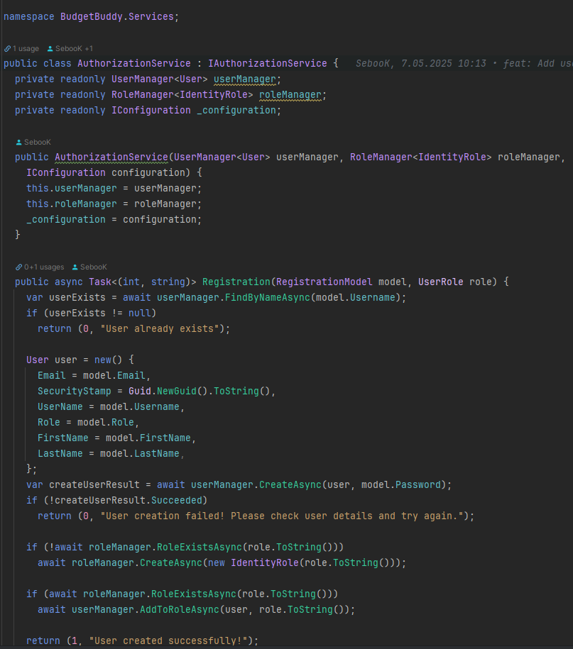

# BudgetBuddy

# 💰 BudgetBuddy

**Twój asystent budżetowy – kontroluj finanse osobiste i rodzinne z łatwością.**

---

## 📝 Opis projektu

**BudgetBuddy** to aplikacja do zarządzania budżetem domowym, stworzona z myślą o osobach, które chcą lepiej kontrolować swoje wydatki i oszczędności. Dzięki niej użytkownicy mogą:

- Śledzić wydatki i dochody
- Kategoryzować transakcje
- Prognozować przyszłe zobowiązania
- Generować szczegółowe raporty finansowe

## 🛠️ Technologie

| Warstwa       | Technologie                                      |
|---------------|--------------------------------------------------|
| Backend       | ASP.NET Core, Serilog, FluentValidation, Swagger |
| Frontend      | Flutter / React Native / MAUI                    |
| Baza danych   | SQLite + Entity Framework Core (ORM)             |
| Język         | C# (Programowanie obiektowe - OOP)               |
| Autoryzacja   | JWT Token, OAuth                                 |
| Powiadomienia | Firebase / SignalR                               |

---

## 🚀 Główne funkcje

- 📊 **Śledzenie wydatków** – monitorowanie codziennych transakcji
- 🗂️ **Kategoryzacja** – przypisywanie wydatków do konkretnych kategorii
- 📅 **Prognozy finansowe** – analiza przyszłych dochodów i zobowiązań
- 📈 **Raporty i wykresy** – wizualizacja budżetu w formie statystyk i diagramów
- ↔️ **Prowadzenie historii transakcji** – archiwizacja wszystkich operacji finansowych (dochody, wydatki)
- 💱 **Wielowalutowość** – obsługa różnych walut i sprawdzanie aktualnych kursów wymiany

---

## 💡 Dodatkowe funkcjonalności

- 👪 **Wspólne zarządzanie budżetem** – dzielenie budżetu z rodziną
- 🎯 **Cele oszczędnościowe** – ustalanie i monitorowanie celów
- 🔍 **Wgląd w wydatki członków rodziny**
- 🔔 **Powiadomienia** – alerty o przekroczeniach budżetu i celach
- 🧾 **Faktury i paragony** – dodawanie dokumentów jako zdjęcia/skany

---

🧩 Paradygmaty obiektowe i ich wykorzystanie
 - W projekcie zastosowano:
   - **Enkapsulacja**: Klasy (np. `User`, `Budget`, `UserBudget`) ukrywają szczegóły implementacji. 
   - **Dziedziczenie**: Wspólne cechy mogą być dziedziczone przez klasy bazowe. 
   - **Polimorfizm**: Rozszerzanie funkcjonalności przez interfejsy i klasy abstrakcyjne. 
   - **Asocjacje** i agregacje: Relacje między encjami, np. `UserBudget` łączy użytkownika z budżetem i rolą. 
   - **Przykład**: Klasa `UserBudget` 
   - Łączy użytkownika (`User`) z budżetem (`Budget`) i określa jego rolę. 
   - Wykorzystuje asocjację (referencje do innych obiektów). 
   - Przykład enkapsulacji: właściwości z [JsonIgnore] ukrywają szczegóły serializacji.

Przykłady

 - 🔷 [Models](Server/Models) w Plikach np.
   - 🔹[User.cs](Server/Models/User.cs),
   - 🔹[Budget.cs](Server/Models/Budget.cs),
   - 🔹[Transaction.cs](Server/Models/Transaction.cs),
   - 🔹[Category.cs](Server/Models/Category.cs),
   - 🔹[Goal.cs](Server/Models/Goal.cs),
   - 🔹[Notifications.cs](Server/Models/Notifications.cs),
   - 🔹[Invoice.cs](Server/Models/Invoice.cs),
   - 🔹[Report.cs](Server/Models/Report.cs)

   
   

   Enkapsulacja (hermetyzacja) danych, Dziedziczenie (User.cs), Asocjacje/agregacje/kompozycje w plikach gdzie mamy
   relacje między modelami

- 🔶Controllers/ 
   w Plikach np.
   - 🔸[UsersController.cs](Server/Controllers/UsersController.cs),
   - 🔸[BudgetController.cs](Server/Controllers/BudgetsController.cs),
   - 🔸[TransactionController.cs](Server/Controllers/TransactionController.cs),






   
---

## 🏗️ Architektura
   - Projekt oparty jest na architekturze warstwowej:
   - Modele domenowe (`Models`/): encje biznesowe (np. `User`, `Budget`)
   - Kontrolery (`Controllers`/): logika HTTP i komunikacja z frontendem
   - Usługi (`Services`/): logika biznesowa
   - Infrastruktura (`Infrastructure`/): kontekst bazy danych, migracje

## 🧱 Możliwe klasy w projekcie

- `Expense` – pojedynczy wydatek (kwota, kategoria, data, użytkownik)
- `Category` – kategorie wydatków (Jedzenie, Transport, Rozrywka)
- `User` – użytkownik aplikacji (np. Administrator, Członek rodziny)
- `Budget` – domowy budżet
- `Goal` – cele oszczędnościowe
- `Transaction` – historia transakcji
- `Notification` – powiadomienia użytkowników
- `Invoice` – faktury i paragony
- `Report` – raporty finansowe

---

## 🔜 Planowane funkcjonalności

- Zaimplementować obsługę wielu walut na poziomie frontend.
- Obsługa powiadomień push dla mobilnych aplikacji.
- Obsługa wielu języków.
- Poprawa funkcjonowania dark mode.
- Spreparowanie raportów i statystyk finansowych z możliwością eksportu do PDF/CSV.
- Dodanie modułu do zarządzania subskrypcjami i cyklicznymi płatnościami.

## 🆘 Napotkane problemy

- Problemy z konfiguracją środowiska .NET 8.0+ i Entity Framework Core (MacOS).
- Trudności z integracją Fluttera z backendem ASP.NET Core.
- Problemy z migracjami bazy danych i synchronizacją modeli.

---

## 👥 Autorzy

- Katarzyna Krawczyk  
- Jakub Kowalczyk  
- Sebastian Kamiński

---

## ⚠️ Uwaga:
 Przed pierwszym uruchomieniem upewnij się, że masz zainstalowane:
  - .NET 8.0+
  - Flutter SDK
  - SQL Server (lub inny zgodny z EF Core, po zmianie connection stringa)

## 🔧 Configuration

Before running the application, ensure that the connection string in the `appsettings.json` file is correctly configured.

### Default Connection String

The `DefaultConnection` string is located in the `Server/appsettings.json` file:

```json
  "DefaultConnection": "Server=YOUR_SERVER_NAME;Database=YOUR_DATABASE_NAME;Trusted_Connection=True;MultipleActiveResultSets=true;TrustServerCertificate=true"
```

## 🚀 Instalacja i uruchomienie

### Backend (Server)

1. **Klonuj repozytorium:**
   ```bash
   git clone https://github.com/SebayK/BudgetBuddy.git
   ```
2. **Przejdź do katalogu projektu:**
   ```bash
   cd Server
   ```
3. **Zainstaluj zależności zainicjuj bazę danych:**
   ```bash
    dotnet restore
    dotnet ef database update
    ```
4. **Uruchom server:**
     ```bash
   dotnet run
   ```

### Frontend (Client)
1. **Przejdź do katalogu klienta:**
   ```bash
   cd Frontend
   ```
2. **Zainstaluj zależności:**
   ```bash
    flutter pub get
    ```
3. **Uruchom aplikację:**
4. ```bash
   flutter run
   ```
   

