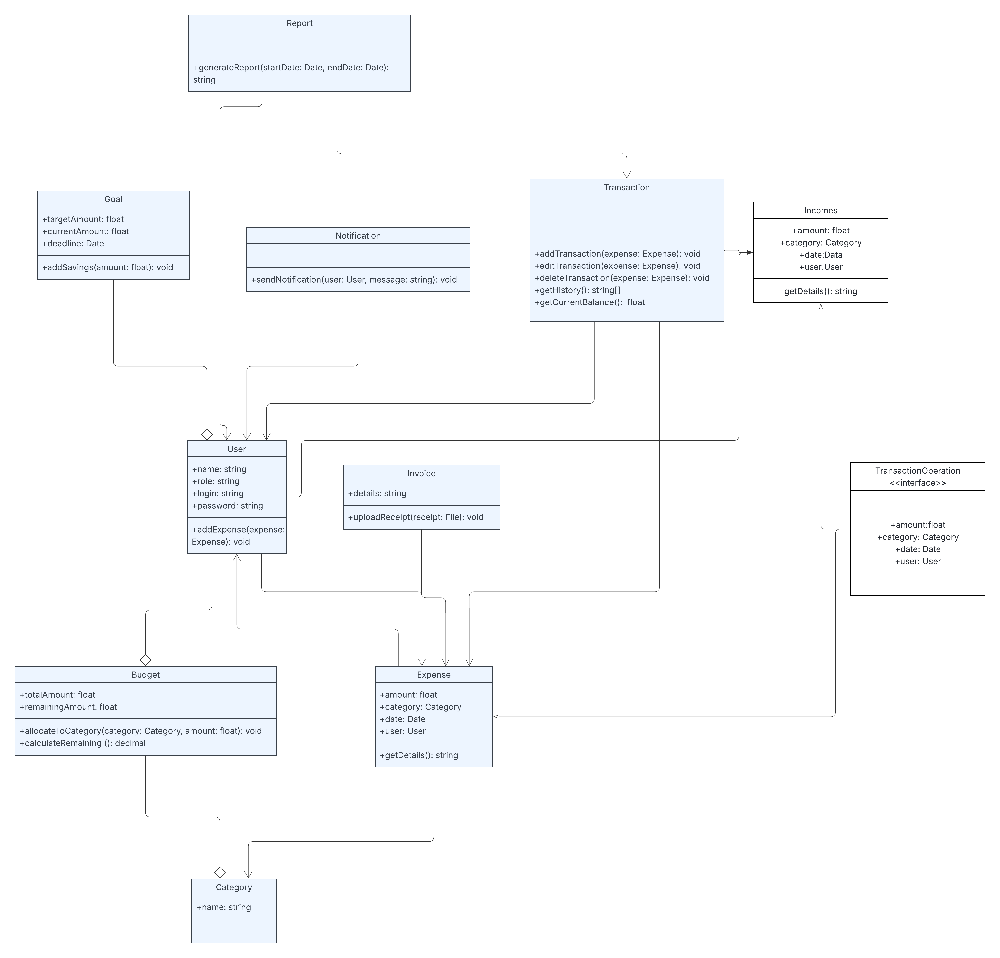
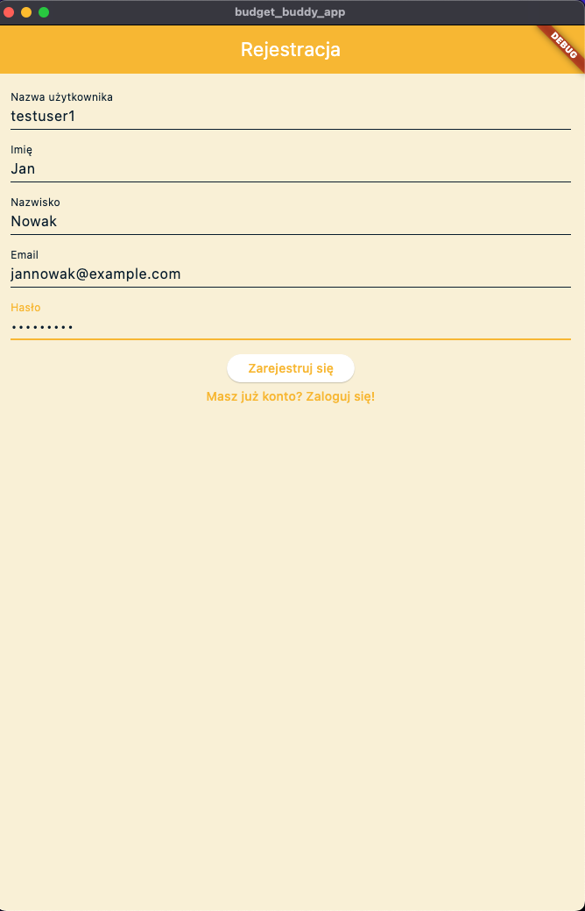
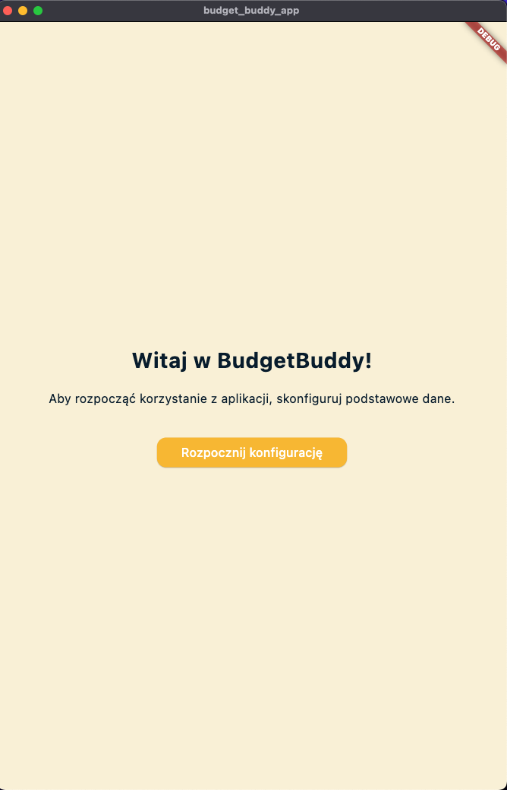
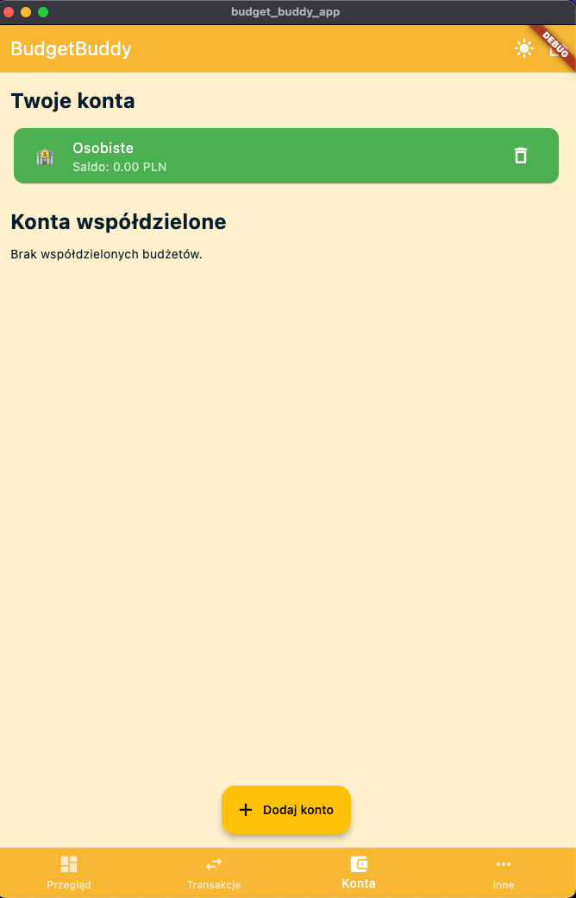
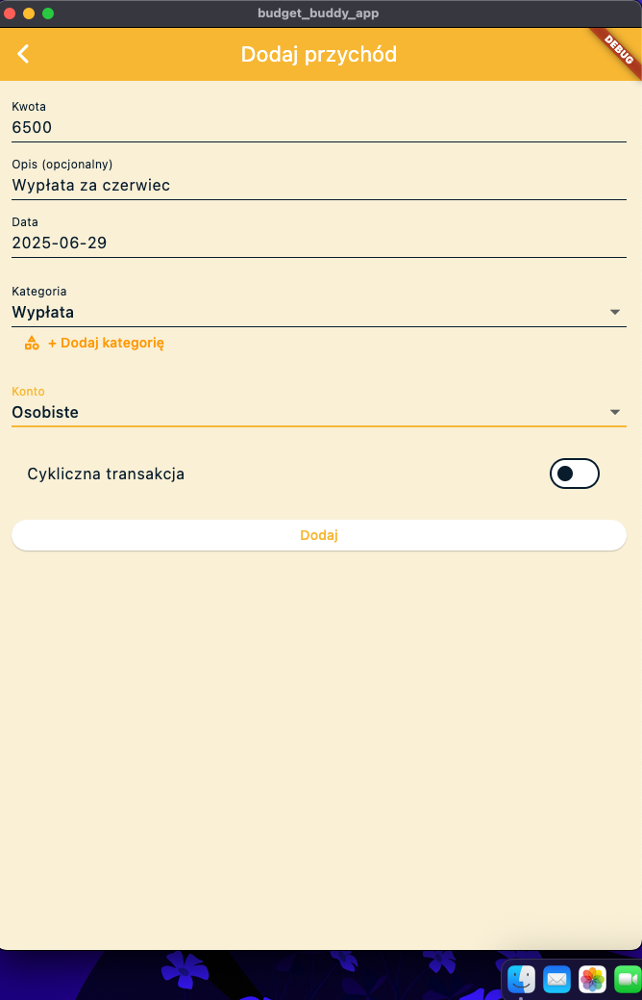
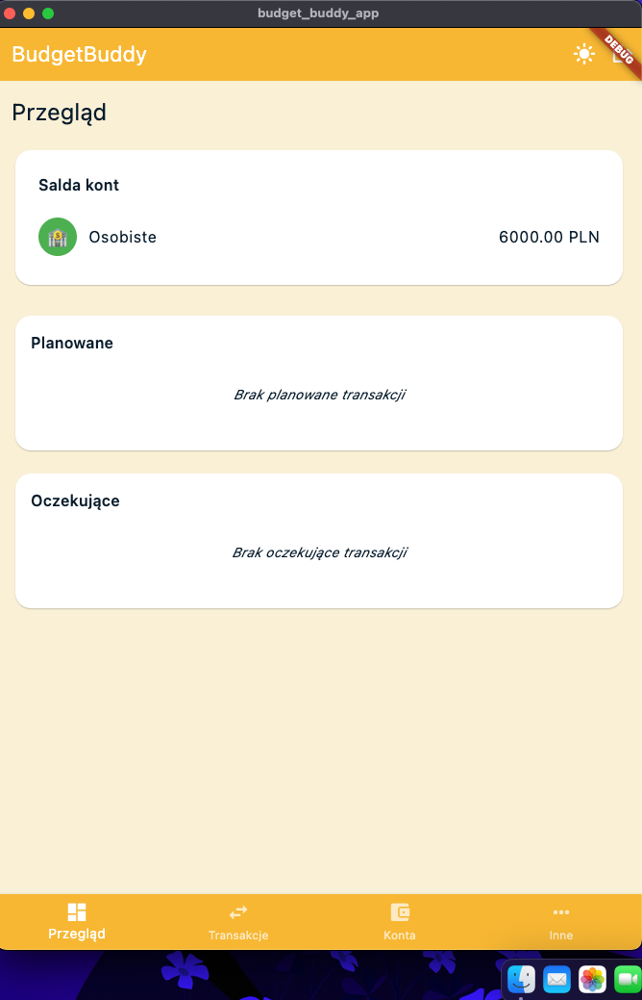
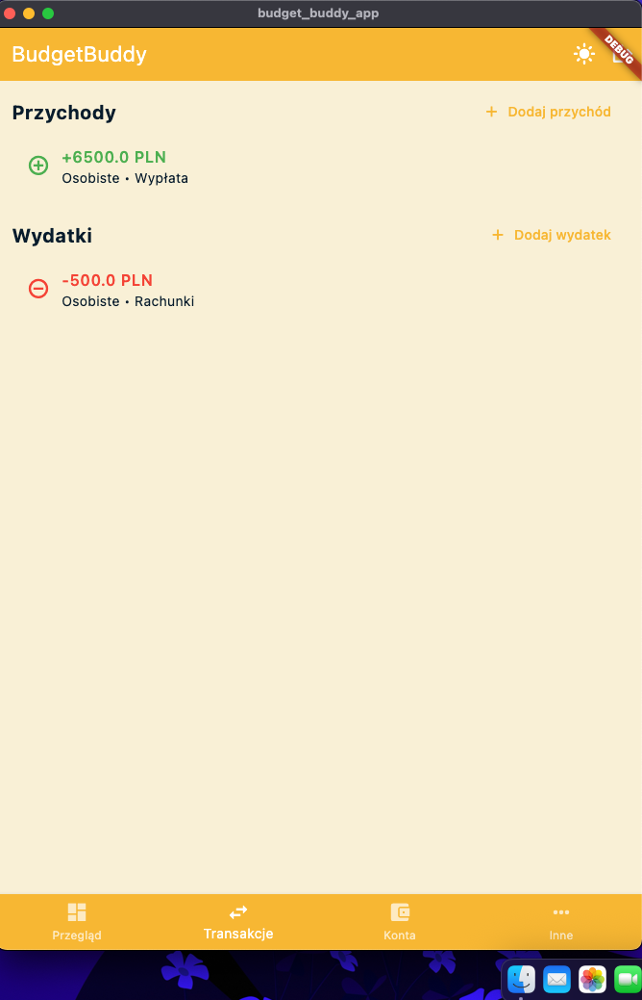
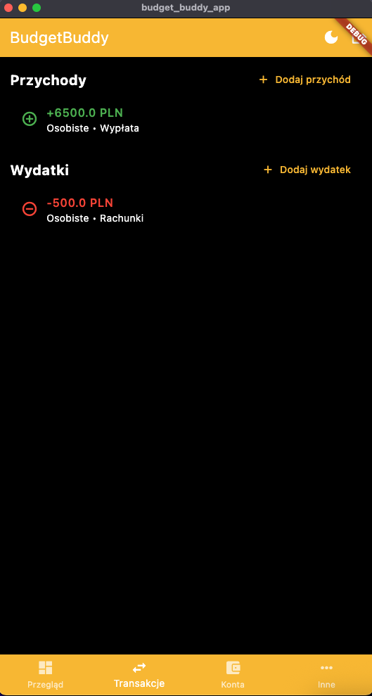

# BudgetBuddy****

# 💰 BudgetBuddy

**Twój asystent budżetowy – kontroluj finanse osobiste i rodzinne z łatwością.**

---

## 📝 Opis projektu

**BudgetBuddy** to aplikacja do zarządzania budżetem domowym, stworzona z myślą o osobach, które chcą lepiej kontrolować swoje wydatki i oszczędności. Dzięki niej użytkownicy mogą:

- Śledzić wydatki i dochody
- Kategoryzować transakcje
- Prognozować przyszłe zobowiązania
- Generować szczegółowe raporty finansowe

## 🛠️ Technologie


| Warstwa       | Technologie                                      |
| ------------- | ------------------------------------------------ |
| Backend       | ASP.NET Core, Serilog, FluentValidation, Swagger |
| Frontend      | Flutter / React Native / MAUI                    |
| Baza danych   | SQLite + Entity Framework Core (ORM)             |
| Język        | C# (Programowanie obiektowe - OOP)               |
| Autoryzacja   | JWT Token, OAuth                                 |
| Powiadomienia | Firebase / SignalR                               |

---

## Diagram UML



## 🚀 Główne funkcje

- 📊 **Śledzenie wydatków** – monitorowanie codziennych transakcji
- 🗂️ **Kategoryzacja** – przypisywanie wydatków do konkretnych kategorii
- 📅 **Prognozy finansowe** – analiza przyszłych dochodów i zobowiązań
- 📈 **Raporty i wykresy** – wizualizacja budżetu w formie statystyk i diagramów
- ↔️ **Prowadzenie historii transakcji** – archiwizacja wszystkich operacji finansowych (dochody, wydatki)
- 💱 **Wielowalutowość** – obsługa różnych walut i sprawdzanie aktualnych kursów wymiany

---

## 💡 Dodatkowe funkcjonalności

- 👪 **Wspólne zarządzanie budżetem** – dzielenie budżetu z rodziną
- 🎯 **Cele oszczędnościowe** – ustalanie i monitorowanie celów
- 🔍 **Wgląd w wydatki członków rodziny**
- 🔔 **Powiadomienia** – alerty o przekroczeniach budżetu i celach
- 🧾 **Faktury i paragony** – dodawanie dokumentów jako zdjęcia/skany

---

## 🧩 Paradygmaty obiektowe i ich wykorzystanie

- W projekcie zastosowano:
  - **Enkapsulacja**: Klasy (np. `User`, `Budget`, `UserBudget`) ukrywają szczegóły implementacji.
  - **Dziedziczenie**: Wspólne cechy mogą być dziedziczone przez klasy bazowe.
  - **Polimorfizm**: Rozszerzanie funkcjonalności przez interfejsy i klasy abstrakcyjne.
  - **Asocjacje** i agregacje: Relacje między encjami, np. `UserBudget` łączy użytkownika z budżetem i rolą.
  - **Przykład**: Klasa `UserBudget`
  - Łączy użytkownika (`User`) z budżetem (`Budget`) i określa jego rolę.
  - Wykorzystuje asocjację (referencje do innych obiektów).
  - Przykład enkapsulacji: właściwości z [JsonIgnore] ukrywają szczegóły serializacji.

Przykłady

- 🔷 [Models](Server/Models) w Plikach np.

  - 🔹[User.cs](Server/Models/User.cs),
  - 🔹[Budget.cs](Server/Models/Budget.cs),
  - 🔹[Transaction.cs](Server/Models/Transaction.cs),
  - 🔹[Category.cs](Server/Models/Category.cs),
  - 🔹[Goal.cs](Server/Models/Goal.cs),
  - 🔹[Notifications.cs](Server/Models/Notifications.cs),
  - 🔹[Invoice.cs](Server/Models/Invoice.cs),
  - 🔹[Report.cs](Server/Models/Report.cs)

  
  

  Enkapsulacja (hermetyzacja) danych, Dziedziczenie (User.cs), Asocjacje/agregacje/kompozycje w plikach gdzie mamy
  relacje między modelami
- 🔶Controllers/
  w Plikach np.

  - 🔸[UsersController.cs](Server/Controllers/UsersController.cs),
  - 🔸[BudgetController.cs](Server/Controllers/BudgetsController.cs),
  - 🔸[TransactionController.cs](Server/Controllers/TransactionController.cs),


---

## 🏗️ Architektura

- Projekt oparty jest na architekturze warstwowej:
- Modele domenowe (`Models`/): encje biznesowe (np. `User`, `Budget`)
- Kontrolery (`Controllers`/): logika HTTP i komunikacja z frontendem
- Usługi (`Services`/): logika biznesowa
- Infrastruktura (`Infrastructure`/): kontekst bazy danych, migracje

## 🧱 Możliwe klasy w projekcie

- `Expense` – pojedynczy wydatek (kwota, kategoria, data, użytkownik)
- `Category` – kategorie wydatków (Jedzenie, Transport, Rozrywka)
- `User` – użytkownik aplikacji (np. Administrator, Członek rodziny)
- `Budget` – domowy budżet
- `Goal` – cele oszczędnościowe
- `Transaction` – historia transakcji
- `Notification` – powiadomienia użytkowników
- `Invoice` – faktury i paragony
- `Report` – raporty finansowe

---

## 🔜 Planowane funkcjonalności

- Zaimplementować obsługę wielu walut na poziomie frontend.
- Obsługa powiadomień push dla mobilnych aplikacji.
- Obsługa wielu języków.
- Poprawa funkcjonowania dark mode.
- Spreparowanie raportów i statystyk finansowych z możliwością eksportu do PDF/CSV.
- Dodanie modułu do zarządzania subskrypcjami i cyklicznymi płatnościami.

## 🆘 Napotkane problemy

- Problemy z konfiguracją środowiska .NET 8.0+ i Entity Framework Core (MacOS).
- Trudności z integracją Fluttera z backendem ASP.NET Core.
- Problemy z migracjami bazy danych i synchronizacją modeli.

---

## 👥 Autorzy

- Katarzyna Krawczyk
- Jakub Kowalczyk
- Sebastian Kamiński

---

## ⚠️ Uwaga:

Przed pierwszym uruchomieniem upewnij się, że masz zainstalowane:

- .NET 8.0+
- Flutter SDK
- SQL Server (lub inny zgodny z EF Core, po zmianie connection stringa)

## 🔧 Configuration

Before running the application, ensure that the connection string in the `appsettings.json` file is correctly configured.

### Default Connection String

The `DefaultConnection` string is located in the `Server/appsettings.json` file:

```json
  "DefaultConnection": "Server=YOUR_SERVER_NAME;Database=YOUR_DATABASE_NAME;Trusted_Connection=True;MultipleActiveResultSets=true;TrustServerCertificate=true"
```

## 🚀 Instalacja i uruchomienie

### Backend (Server)

1. **Klonuj repozytorium:**
   ```bash
   git clone https://github.com/SebayK/BudgetBuddy.git
   ```
2. **Przejdź do katalogu projektu:**
   ```bash
   cd Server
   ```
3. **Zainstaluj zależności zainicjuj bazę danych:**
   ```bash
    dotnet restore
    dotnet ef database update
   ```
4. **Uruchom server:**
   ```bash
   dotnet run
   ```

### Frontend (Client)

1. **Przejdź do katalogu klienta:**

   ```bash
   cd Frontend
   ```
2. **Zainstaluj zależności:**

   ```bash
    flutter pub get
   ```
3. **Uruchom aplikację:**
4. ```bash
   flutter run
   ```

## 🚀 Działanie aplikacji

### 1. Rejestracja i logowanie

Jeśli użytkownik nie ma konta, może się zarejestrować, podając:

* nazwę użytkownika
* imię i nazwisko
* adres e-mail
* hasło

Jeśli konto już istnieje – pojawia się ekran logowania.



---

### 2. Ekran powitalny

Po uruchomieniu aplikacji użytkownik widzi ekran powitalny z komunikatem:
**„Witaj w BudgetBuddy!”**
Należy kliknąć** ****„Rozpocznij konfigurację”**, aby przejść dalej.



---

### 3. Pierwsza konfiguracja

Aplikacja prowadzi użytkownika przez 3-etapowy kreator:

1. Nowy budżet
2. Powiadomienia
3. Zakończenie konfiguracji

Po kliknięciu** ****„Zakończ”**, użytkownik zostaje przeniesiony do głównego widoku aplikacji.


---

### 4. Dodanie pierwszego konta

Po zakończeniu konfiguracji użytkownik może utworzyć swoje pierwsze konto – np.** ****„Osobiste”**.

🔹 Konta mogą być:

* **indywidualne** (dostępne w aplikacji)
* **współdzielone** (funkcjonalność zaimplementowana w backendzie – planowane rozwinięcie we frontendzie)



---

### 5. Dodawanie przychodów i wydatków

Użytkownik może dodawać transakcje:

* ✅ Przychody (np. wypłata)
* ❌ Wydatki (np. rachunki)

Dostępne opcje:

* kwota, opis, data i kategoria
* możliwość oznaczenia transakcji jako** ****cyklicznej**




---

### 6. Przegląd finansów

Ekran** ****Przegląd** prezentuje:

* aktualne saldo kont
* sekcje „Planowane” i „Oczekujące” transakcje (funkcjonalność poglądowa – do dalszego rozwoju)



---

### 7. Historia transakcji

Zakładka** ****Transakcje** pokazuje historię wszystkich przychodów i wydatków, z podziałem na konta i przypisane kategorie.



---

### 8. Tryb ciemny

Aplikacja wspiera** ****tryb ciemny**.
Można go aktywować w prawym górnym rogu interfejsu.




## 📘 Dokumentacja API – Swagger

Aplikacja BudgetBuddy udostępnia interfejs REST API, który można wygodnie testować i dokumentować za pomocą** ****Swagger UI**.

---

### ✅ Jak uruchomić Swaggera?

1. Uruchom backend (np. przez** **`dotnet run` lub bezpośrednio w Riderze)
2. Otwórz przeglądarkę i przejdź do:

```bash
http://localhost:5000/swagger

```

*(lub inny port, jeśli masz ustawiony niestandardowy)*

---

### 🔐 Autoryzacja (JWT)

Większość endpointów wymaga autoryzacji tokenem JWT. Aby się zalogować i uzyskać token:

1. W Swaggerze przejdź do** **`POST /api/auth/login`
2. Podaj dane logowania i kliknij** ****Execute**
3. Skopiuj token JWT z odpowiedzi
4. Kliknij** ****Authorize** (w prawym górnym rogu Swaggera)
5. Wklej token w formacie:

```php-template
Bearer <twój_token>
```

---

### 📥 Przykład: dodanie transakcji przez Swaggera

Po autoryzacji przejdź do:

* `POST /api/transactions`
* Kliknij** ****Try it out**
* Wprowadź przykładowe dane:

```json
{
  "amount": 6500,
  "description": "Wypłata za czerwiec",
  "date": "2025-06-29",
  "category": "Wypłata",
  "accountId": 1,
  "isCyclic": true
}

```

* Kliknij** ****Execute**, aby dodać transakcję

---

### 📚 Co możesz testować przez Swaggera?

* ✅ Rejestracja i logowanie (`/api/auth`)
* ✅ Tworzenie budżetu, konta, transakcji
* ✅ Pobieranie sald, historii transakcji
* ✅ Obsługa użytkowników i uprawnień
